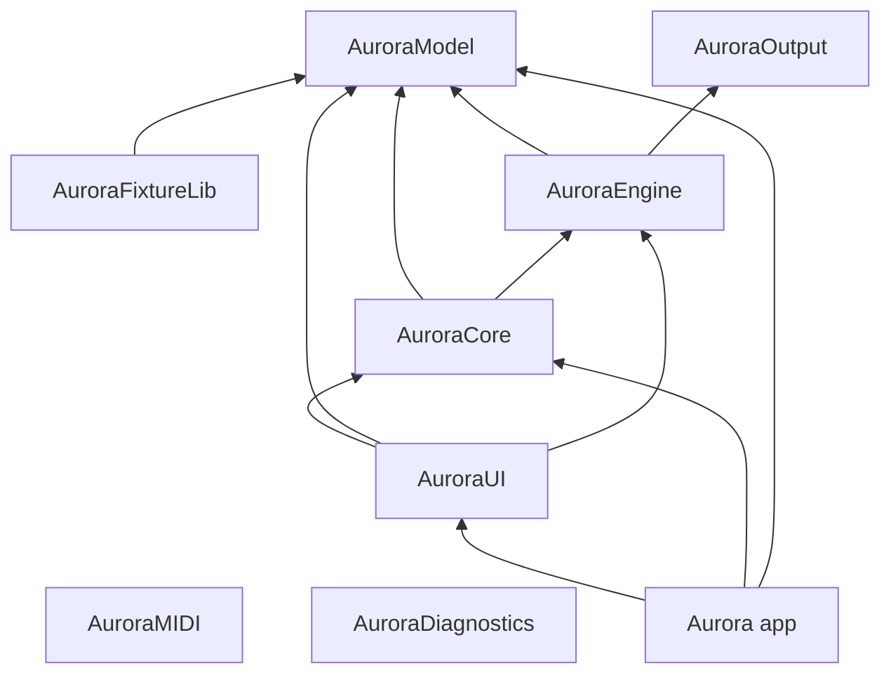

# PR1 — Project Scaffold & Module Layout

| Field | Value |
|-------|--------|
| **PR** | PR1 |
| **Title** | Project scaffold & module layout |
| **Status** | Implemented (scaffold in tree) |
| **Depends on** | — |
| **Unblocks** | PR2 (domain model), PR3–4 (core), PR7 (UI shell), PR16 (MIDI) |
| **Parent design** | [`aurora-system-design.md`](./aurora-system-design.md) §3.2, §17, §18 |

---

## 1. Purpose

Establish a **buildable, multi-module Swift repository** aligned with the system design module map:

1. Library modules with **allowed dependency edges** encoded in SPM  
2. A minimal **macOS app shell** that links core libraries  
3. **Unit / smoke tests** that prove modules import and link  
4. **Repo hygiene** (`.gitignore`, README build instructions)  
5. This document as the implementer-facing PR1 spec  

PR1 contains **almost no product logic**. It proves structure, dependencies, and a “hello Aurora” UI path.

---

## 2. Non-goals

| Out of scope | Belongs to |
|--------------|------------|
| `ShowProject`, Codable, package I/O | PR2 |
| Command / undo | PR3 |
| Event bus / selection | PR4 |
| Fixture definitions, patch UI, docking | PR5–PR8 |
| Engine loop, DMX, MIDI implementations | PR9+ / PR16+ |
| Document-based open/save | PR2 / PR7 |
| Art-Net, effects, songs | later PRs |

---

## 3. Key decisions (PR1)

| Decision | Choice | Rationale |
|----------|--------|-----------|
| Layout | Single root `Package.swift`, sources under `Sources/` | Simple monorepo; Xcode can open the package |
| App packaging | SPM executable product `Aurora` (no committed `.xcodeproj`) | Fewer artifacts; upgrade app target in PR7 |
| Min OS | macOS 14.0 | Matches KD11 in system design |
| Module stubs | Public identity enum per library | Compile-time surface for tests and app |
| Domain logic | None | Keep PR1 reviewable and small |
| Naming | Design `AuroraApp` → SPM product/target `Aurora` | Avoid clashing with library module names |

---

## 4. Repository layout

```
Aurora/
├── Package.swift
├── README.md
├── .gitignore
├── Aurora Lighting Control System.pdf
├── docs/
│   └── design/
│       ├── aurora-system-design.md
│       └── pr1-project-scaffold.md      ← this file
├── Sources/
│   ├── AuroraModel/
│   ├── AuroraCore/
│   ├── AuroraEngine/
│   ├── AuroraMIDI/
│   ├── AuroraOutput/
│   ├── AuroraFixtureLib/
│   ├── AuroraDiagnostics/
│   ├── AuroraUI/
│   └── Aurora/                          ← app executable (design: AuroraApp)
│       ├── AuroraApp.swift
│       └── ContentView.swift
└── Tests/
    ├── AuroraModelTests/
    ├── AuroraCoreTests/
    └── AuroraPackageSmokeTests/
```

---

## 5. Module products

| Product | Kind | Responsibility (eventual) | PR1 content |
|---------|------|---------------------------|-------------|
| `AuroraModel` | library | Pure show data types | Identity stub |
| `AuroraCore` | library | Commands, undo, project manager, events | Identity stub |
| `AuroraEngine` | library | Cue/playback/programmer/scheduler | Identity stub |
| `AuroraMIDI` | library | CoreMIDI, RTP-MIDI, learn | Identity stub |
| `AuroraOutput` | library | DMX buffers, drivers | Identity stub |
| `AuroraFixtureLib` | library | Personalities, seed library | Identity stub |
| `AuroraDiagnostics` | library | Logging, monitors, metrics | Identity stub |
| `AuroraUI` | library | Panels, workspace, views | Identity + helper used by app |
| `Aurora` | executable | App entry (design name: AuroraApp) | SwiftUI window listing modules |

---

## 6. Dependency graph

### 6.1 Allowed edges (source of truth: `Package.swift`)

```
AuroraModel          → (none)
AuroraFixtureLib     → AuroraModel
AuroraOutput         → (none)
AuroraEngine         → AuroraModel, AuroraOutput
AuroraCore           → AuroraModel, AuroraEngine
AuroraMIDI           → (none)
AuroraDiagnostics    → (none)
AuroraUI             → AuroraCore, AuroraModel, AuroraEngine
Aurora (app)         → AuroraUI, AuroraCore, AuroraModel
```

### 6.2 Forbidden (examples)

- `AuroraUI` → `AuroraOutput`  
- `AuroraUI` → `AuroraMIDI`  
- `AuroraModel` → anything  

UI must not talk to hardware drivers. MIDI and Output stay behind Core/Engine boundaries as the design matures.

### 6.3 Diagram



---

## 7. Stub API convention

Each library exposes:

```swift
public enum <Module>Module {
    public static let name: String
    public static let version: String  // "0.1.0-pr1"
}
```

Examples: `AuroraModelModule`, `AuroraCoreModule`, …

`AuroraUI` additionally exposes a small helper that returns display rows for the scaffold window (module name + version), so the app does not hard-code every library string.

---

## 8. App shell

- `@main struct AuroraApp: App` with a single `WindowGroup`  
- `ContentView`: title **Aurora**, subtitle **PR1 scaffold**, list of linked module identities  
- No document browser, menus customization, docking, or file I/O  

---

## 9. Tests

| Target | What it proves |
|--------|----------------|
| `AuroraModelTests` | Model identity API |
| `AuroraCoreTests` | Core identity API; Core can see Model via its dependency |
| `AuroraPackageSmokeTests` | Every library imports; identity names match expected strings |

---

## 10. Build / test / run

**Planning** may happen on Linux; **build/test/run** require macOS. See [`docs/development-workflow.md`](../development-workflow.md).

**Prerequisites (verify host):** macOS 14+, Xcode 15+ / Swift 5.9+ (package is macOS-only).

```bash
cd /path/to/Aurora
swift build
swift test
swift run Aurora
```

Or open `Package.swift` in Xcode and run the `Aurora` scheme.

---

## 11. Acceptance criteria

- [x] `Package.swift` defines all modules from system design §3.2 (app product `Aurora`)  
- [x] Dependency edges match §6; no UI → Output/MIDI  
- [x] Each library has identity API  
- [x] App sources show scaffold UI listing modules  
- [ ] `swift test` / app launch verified on a Mac *(expected pending until run on macOS; not a Linux failure)*  
- [x] `.gitignore` present  
- [x] This document written  
- [x] README documents build/run/test  
- [x] No domain model / engine / MIDI behavior beyond stubs  

---

## 12. PR description (for Git hosting)

**Title:** PR1: Project scaffold & module layout  

**Summary:** Introduce the Swift package monorepo with empty library modules (`AuroraModel`, `AuroraCore`, `AuroraEngine`, `AuroraMIDI`, `AuroraOutput`, `AuroraFixtureLib`, `AuroraDiagnostics`, `AuroraUI`), a minimal macOS executable `Aurora`, smoke tests, and documentation. No product features yet.

**Test plan:**

1. `swift test` on macOS 14+  
2. `swift run Aurora` — window lists module names/versions  
3. Confirm `Package.swift` dependencies match `docs/design/pr1-project-scaffold.md` §6  

---

## 13. Next: PR2 entry points

PR2 should:

1. Add real types under `Sources/AuroraModel/` (`ShowProject`, universes, fixtures, …)  
2. Implement package document load/save + schema version  
3. Add golden round-trip tests in `AuroraModelTests`  
4. Keep UI on identity list or show project name only when a sample project loads (optional minimal hook)

Do not expand MIDI/Output/Engine beyond stubs in PR2.

---

## 14. Document history

| Version | Date | Notes |
|---------|------|--------|
| 1.0 | 2026-08-04 | Initial PR1 scaffold specification and implementation |
